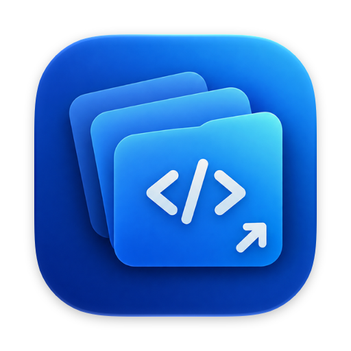
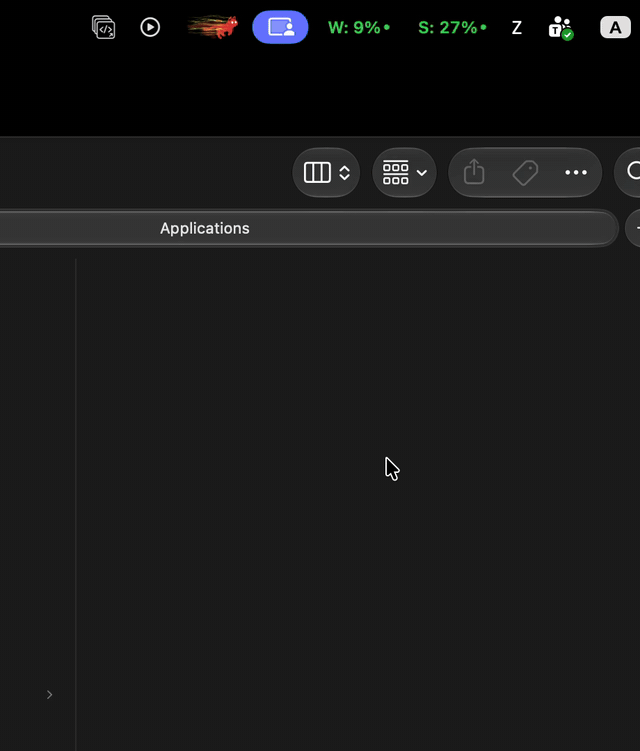
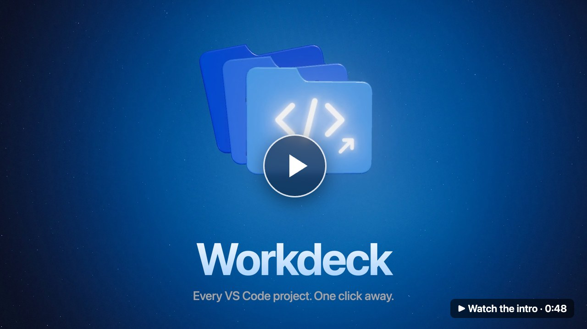

<p align="center">
  
</p>

<h1 align="center">Workdeck</h1>

<p align="center">A tiny native macOS menu bar app that lists every VS Code project on your machine and opens any of them in one click.</p>

<p align="center">
  <a href="https://github.com/kijtiaskp/workdeck/releases/latest"></a>
  <a href="LICENSE"></a>
</p>

<p align="center">
  
</p>

<p align="center">
  <a href="docs/intro.mp4"></a>
</p>

---

No more `cd some/deep/path && code .`. Workdeck scans your projects folder, finds every `.code-workspace` file and Git repository, and shows them grouped in a searchable menu bar popup.

## Features

- **Automatic discovery** of `.code-workspace` files and Git repositories, rescanned every time the popup opens.
- **No duplicates**: repositories already listed in a `.code-workspace` file's `folders` are hidden, so each project appears once.
- **One list**: each project row shows its Git branch, uncommitted file count, and commits ahead of or behind the upstream, plus a button that opens the repository on GitHub or whichever host its `origin` remote points to.
- **Project status**: expand a project to see its prod and dev URLs, which [portless](https://github.com/vercel-labs/portless) apps are running, and which database environment each running backend is connected to.
- **Multiple root folders**: scan several project folders, and show all of them or one at a time.
- **Current project in the menu bar**: optionally show which workspace or folder the focused VS Code window has open.
- **Search and open**: type to filter, press Return to open the first match, or click any row.
- **Native and lightweight**: SwiftUI `MenuBarExtra`, no Dock icon, no Electron, no dependencies.
- **No `code` CLI required**: projects open through `NSWorkspace` using the VS Code app bundle.

## Requirements

- macOS 14 Sonoma or later
- Visual Studio Code
- Git at `/usr/bin/git`, included with the Xcode Command Line Tools
- Swift toolchain: Xcode, or the Xcode Command Line Tools

## Install

### Download

1. Download `Workdeck-<version>.zip` from the [latest release](https://github.com/kijtiaskp/workdeck/releases/latest). The build runs on Apple Silicon only.
2. Unzip it and move `Workdeck.app` to `/Applications`.
3. The app is not notarized, so remove the quarantine flag once before the first launch:

```sh
xattr -dr com.apple.quarantine /Applications/Workdeck.app
```

### Build from source

```sh
git clone https://github.com/kijtiaskp/workdeck.git
cd workdeck
./scripts/build-app.sh
```

The script builds a release binary, wraps it in `Workdeck.app`, signs it ad hoc, installs it to `/Applications`, and launches it.

To start Workdeck automatically, add it in **System Settings → General → Login Items**.

## Configuration

Workdeck scans `~/Developer` by default. Use the folder menu next to the search field to manage root folders:

- **All Folders** or a single folder name chooses what the list shows.
- **Add Folder…** opens a folder picker. You can select several folders at once.
- **Remove Folder** removes a root from the list. Your files are not touched.

When several roots are shown together, each section title starts with its root folder name.

Root folders can also be set from the terminal:

```sh
defaults write com.kijtisakp.Workdeck ScanRoots -array ~/work ~/personal
```

Changes apply the next time the popup opens.

## Menu bar label

Open the gear menu in the popup footer to choose how the menu bar item looks:

- **Icon** shows only the Workdeck icon. This is the default.
- **Text** shows the name of the workspace or folder in the focused VS Code window.
- **Icon and Text** shows both.

The name updates when you switch VS Code windows and stays on the last VS Code window while you use other apps.

The label is exactly as wide as the name. macOS hides menu bar items that do not fit next to the notch, which can happen with long names while VS Code shows its full menu. If Workdeck disappears, choose a shorter **Name Length** in the gear menu: 24, 16, or 12 characters.

Text modes read VS Code window titles, so macOS asks you to allow Workdeck in **System Settings → Privacy & Security → Accessibility**. Builds from `build-app.sh` are signed ad hoc, so after rebuilding you may need to remove Workdeck from that list and allow it again.

The name is taken from the default VS Code window title. If you changed `window.title`, keep `${rootName}` in it.

## Project status

Projects that have environment links or [portless](https://github.com/vercel-labs/portless) apps show a chevron. Expand it to see them. Click a URL to open it in the browser, or right-click it to copy.

### PostgreSQL

PostgreSQL versions installed as Homebrew services appear at the top of the list with their state and port. Press play or stop to run `brew services start` or `brew services stop`. A server started outside `brew services` still shows as running when it listens on its configured port.

### Environment links

Right-click a project and choose **Edit Environment Links…** to create and open `.workdeck.json` in the project folder (the folder that contains the `.code-workspace` file, or the repository folder):

```json
{
  "environments": {
    "prod": {
      "Web": "https://example.com",
      "API": "https://api.example.com"
    },
    "dev": {
      "Web": "https://dev.example.com",
      "API": "https://api.dev.example.com"
    }
  }
}
```

Any environment name works. `prod`, `pre-prod`, `staging`, `uat`, and `dev` are listed first.

### Tailnet

If `tailscale serve` shares a local port, the project shows a **TAILNET** row with the public `ts.net` URL, the app behind it, and whether it is running.

When several apps must be reached through the same `ts.net` URL, for example LIFF apps registered to one domain, list them in `.workdeck.json` with the port that `tailscale serve` forwards:

```json
{
  "tailnet": {
    "port": 5480,
    "apps": {
      "register": { "folder": "register", "path": "/?liff_id=1234567890-abcdefgh" },
      "feedback": { "folder": "feedback", "script": "dev" }
    }
  }
}
```

Every app appears under **LOCAL**. Pressing play stops whatever listens on the port, then runs `<package manager> run <script> --port <port> --strictPort` in the app folder (`script` defaults to `dev`). `path` is appended to the `ts.net` URL, so the link can carry the query string the app needs. Workdeck never changes `tailscale serve` itself.

### Local apps

Workdeck finds portless apps up to two levels below the project folders, from `portless.json` (`{"name": "..."}`) or from `package.json` scripts that call `portless <name>` or `portless run`. An app is running when portless has a live route for its name. Workdeck reads the portless state in `~/.portless`, or `/tmp/portless` for older proxies, and takes the proxy port, HTTPS setting, and TLD from the files the proxy writes there. Workdeck is tested with portless 0.15; routes it cannot read are skipped.

Press the play button next to a stopped app to start it. Workdeck runs `portless` in the app folder through your login shell, so the `portless.json` name and script apply, or `<package manager> run <script>` when the app was found in a `package.json` script. The package manager comes from the nearest lockfile: bun, pnpm, yarn, or npm. Press the stop button to end the app and its child processes. Output goes to `~/Library/Logs/Workdeck/<name>.log`; press the log button next to the app, or right-click it and choose **Show Log**, to follow it live with `tail -f` in Terminal. If an app exits before its route appears, or does not appear within 30 seconds, it is marked **Failed**; click the mark to open its log. Apps that only show up while running, without a config file, can be stopped but not started.

For a running app, Workdeck finds the process listening on the app port and its child processes, and checks their open connections to common database ports (PostgreSQL, MySQL, SQL Server, MongoDB, Redis, CockroachDB):

- A connection to `localhost` is shown as `LOCAL`.
- A connection to a server that hosts one of the project's environment links is shown as that environment.
- Otherwise the remote address is matched against database hosts in the app's `.env` and `.env.*` files. The environment comes from the host name (`prod`, `staging`, `uat`, `dev`), or else from the file name, such as `.env.production`.

## How projects are discovered

Workdeck walks each root folder up to three levels deep and skips hidden folders, `node_modules`, `dist`, `build`, `vendor`, and `Pods`.

1. Every `*.code-workspace` file is listed as a workspace.
2. Folders referenced by those workspace files are marked as covered and skipped.
3. Any other folder containing `.git` is listed as a plain folder, and its subfolders are not scanned.

Items are grouped by their top-level folder under the scan root.

Git status comes from the repository at the workspace folder, or the first repository a workspace file references. Repositories nested inside other repositories are listed as their own rows. Status is read with `git status --porcelain --branch` in the background when the popup opens.

## Building with Command Line Tools only

The macOS 27 SDK requires the `SwiftUIMacros` compiler plugin, which ships only with Xcode. When Xcode is not installed, `build-app.sh` automatically builds against the macOS 26.5 SDK from the Command Line Tools if it is available. Set `SDKROOT` yourself to override this.

## Intro video

[`docs/intro.mp4`](docs/intro.mp4) and its poster are generated from code: a three.js and GSAP scene in [`video/`](video) is rendered frame by frame in headless Chrome, and the soundtrack is synthesized by [`video/music.py`](video/music.py). Rebuild it with `video/build.sh`, which needs Node.js, Python 3, ffmpeg, and Google Chrome.

## Changelog

See [CHANGELOG.md](CHANGELOG.md) for what each version adds.

## License

[MIT](LICENSE)
