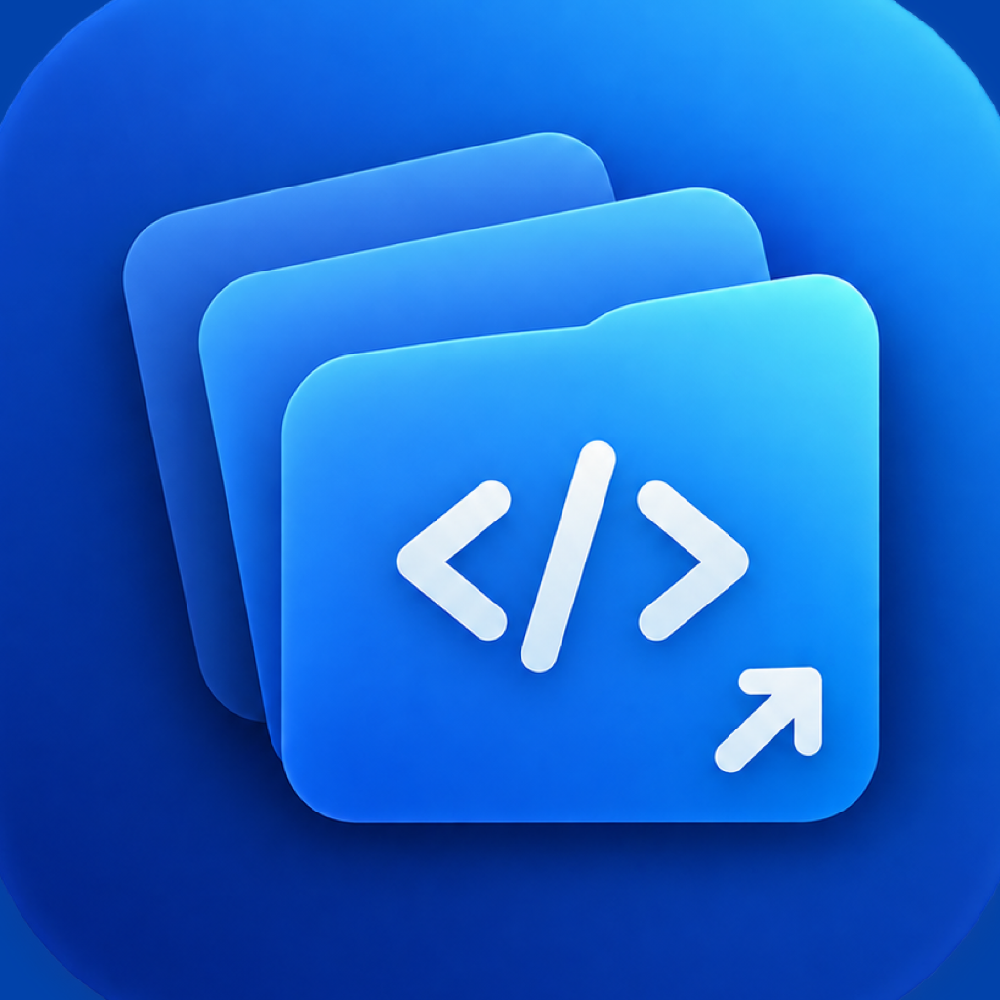

<p align="center">
  
</p>

<h1 align="center">Workdeck</h1>

<p align="center">A tiny native macOS menu bar app that lists every VS Code project on your machine and opens any of them in one click.</p>

<p align="center">
  <a href="https://github.com/kijtiaskp/workdeck/releases/latest"></a>
  <a href="LICENSE"></a>
</p>

---

No more `cd some/deep/path && code .`. Workdeck scans your projects folder, finds every `.code-workspace` file and Git repository, and shows them grouped in a searchable menu bar popup.

## Features

- **Automatic discovery** of `.code-workspace` files and Git repositories, rescanned every time the popup opens.
- **No duplicates**: repositories already listed in a `.code-workspace` file's `folders` are hidden, so each project appears once.
- **Git Repos tab**: every Git repository with its branch, uncommitted file count, and commits ahead of or behind the upstream.
- **Multiple root folders**: scan several project folders, and show all of them or one at a time.
- **Search and open**: type to filter, press Return to open the first match, or click any row.
- **Native and lightweight**: SwiftUI `MenuBarExtra`, no Dock icon, no Electron, no dependencies.
- **No `code` CLI required**: projects open through `NSWorkspace` using the VS Code app bundle.

## Requirements

- macOS 14 Sonoma or later
- Visual Studio Code
- Git at `/usr/bin/git`, included with the Xcode Command Line Tools
- Swift toolchain: Xcode, or the Xcode Command Line Tools

## Install

### Download

1. Download `Workdeck-<version>.zip` from the [latest release](https://github.com/kijtiaskp/workdeck/releases/latest). The build runs on Apple Silicon only.
2. Unzip it and move `Workdeck.app` to `/Applications`.
3. The app is not notarized, so remove the quarantine flag once before the first launch:

```sh
xattr -dr com.apple.quarantine /Applications/Workdeck.app
```

### Build from source

```sh
git clone https://github.com/kijtiaskp/workdeck.git
cd workdeck
./scripts/build-app.sh
```

The script builds a release binary, wraps it in `Workdeck.app`, signs it ad hoc, installs it to `/Applications`, and launches it.

To start Workdeck automatically, add it in **System Settings → General → Login Items**.

## Configuration

Workdeck scans `~/Developer` by default. Use the folder menu next to the search field to manage root folders:

- **All Folders** or a single folder name chooses what the list shows.
- **Add Folder…** opens a folder picker. You can select several folders at once.
- **Remove Folder** removes a root from the list. Your files are not touched.

When several roots are shown together, each section title starts with its root folder name.

Root folders can also be set from the terminal:

```sh
defaults write com.kijtisakp.Workdeck ScanRoots -array ~/work ~/personal
```

Changes apply the next time the popup opens.

## How projects are discovered

Workdeck walks each root folder up to three levels deep and skips hidden folders, `node_modules`, `dist`, `build`, `vendor`, and `Pods`.

1. Every `*.code-workspace` file is listed as a workspace.
2. Folders referenced by those workspace files are marked as covered and skipped.
3. Any other folder containing `.git` is listed as a plain folder, and its subfolders are not scanned.

Items are grouped by their top-level folder under the scan root.

The **Git Repos** tab uses the same root folders and exclusions, but lists every folder that contains `.git`, including repositories inside other repositories or covered by a workspace file. Status is read with `git status --porcelain --branch` in the background when the tab is shown.

## Building with Command Line Tools only

The macOS 27 SDK requires the `SwiftUIMacros` compiler plugin, which ships only with Xcode. When Xcode is not installed, `build-app.sh` automatically builds against the macOS 26.5 SDK from the Command Line Tools if it is available. Set `SDKROOT` yourself to override this.

## Changelog

See [CHANGELOG.md](CHANGELOG.md) for what each version adds.

## License

[MIT](LICENSE)
